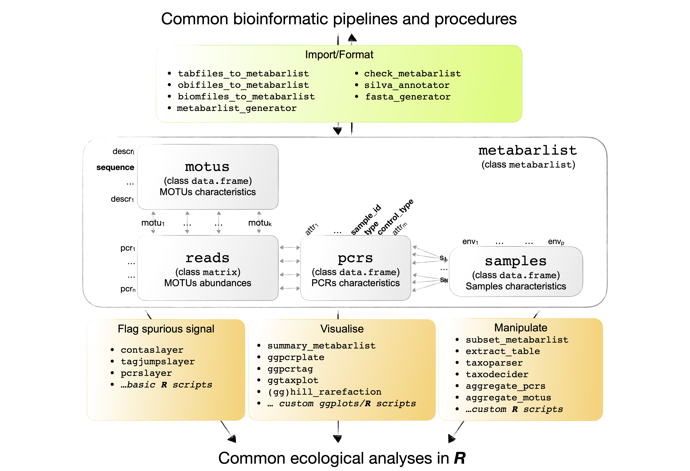

<!-- README.md is generated from README.Rmd. Please edit that file -->


*MetabaR-F* is an package enabling importing, handling and postprocessing metabarcoding data that have been already processed through bioinformatic pipelines. It provides functions to reveal and filter common molecular artifacts produced during the experimental workflow.

Due to its simplicity of structure, this package can be easily used in combination with others packages commonly used in ecology (*vegan*, *ade4*, *ape*, *picante*, etc.), and provides flexible graphic systems based on *ggplot2* to vizualize the data under both ecological and experimental perspectives.

More specifically, *MetabaR-F* provides:

-   Import functions from common bioinformatic pipelines for DNA metabarcoding data (OBITools, <span style="color:red">more to come</span>)
-   Convenient functions to manipulate the suite of data tables one usually deals with when working with DNA metabarcoding.
-   Functions of data curation that are absent from the above pipelines (e.g. detecting and tagging potential molecular artifacts such as contaminants, dysfynctional PCRs, etc.)
-   Functions for visualizing the data under both ecological (e.g. type of samples) and experimental (e.g. type of controls, distribution across the PCR plate design) perspectives.
-   <span style="color:red">Blablabla</span>

*MetabaR-F* is developed on GitHub:

<https://github.com/metabaRfactory/metabaRffe>

Overall overview
----------------

<span style="color:red">Temporary</span> 

Installation
------------

*MetabaR-F* can be installed from github with:

``` r
install.packages("devtools")
devtools::install_github("metabaRfactory/metabaRffe")
```

Pacakge dependencies:
- *ggplot2* and *cowplot*
- *reshape2*
- *vegan*
- *seqinr*
- <span style="color:red">... more?</span>

Example
-------

This is a basic example of use:

``` r
# library(metabaR-F)
# data(soil_euk)
# basic example code TO PROVIDE
```
